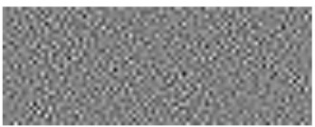
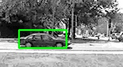

# Linear Discriminant Analysis and Separable Linear Discriminant Analysis 

Linear Discriminant Analysis on UIUC Car Database

A collection of 2556 training image patches of which 2442 are patches of background, tagged as class label C2 , whereas
the rest 124 are patches of containing cars and tagged as class label C1. Each of these ground truth image patches is of size 81 × 31. The 2D visualization of projection vector **w** computed is shown below. From this figure, which is obtained from least squares regression training, there is no car like structural traits upon visualization of **w**.

Visualizing Projection Vector

**Fig.1** (**X**T **X**)-1**X**Ty

