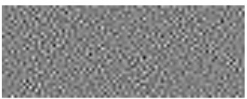

# Linear Discriminant Analysis

Linear Discriminant Analysis on UIUC Car Database

A collection of 2556 training image patches of which 2442 are patches of background, tagged as class label C2 , whereas
the rest 124 are patches of containing cars and tagged as class label C1. Each of these ground truth image patches is of size 81 × 31. The 2D visualization of projection vector **w** computed is shown below. From this figure, which is obtained from least squares regression training, and there is no car like structural traits upon visualization of **w**.
Before deciding best classifier on test data, the precision-recall curves were studied. One such best classifier is obtianed is shown below. 

   

#Projection Vector

The projection vector thus obtained is as follows
(**X**T**X**)-1**X**Ty

# Separable Discriminant Analysis 

Separable Tensor based discriminant analysis

In the previous approach where training image patches x ∈ R m×n of size m × n are vectorized into single 1 dimensional vector. Instead treating images for what they are, we use tensors. In this approach we compute the projection tensor1 by applying tensor contractions to the given set of training image patches and use alternating least squares. 

A tensor also known as n-array or multidimensional matrix or n-mode matrix, is a higher order generalization of a vector (first order tensor) and a matrix (second order tensor). In this short description on second order tensors **X** to represent images.
A typical training set representing grey-value images of size m x n and training set consists of **N** image patches. Tensor discriminant analysis requires a projection tensor **W** which solves the regression problem. This approach address the problem of singular matrices. 

